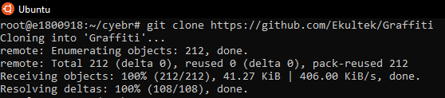

# Study of one of the hacking SUBJECT 

  

# What GRAFFITI is?
Graffiti is a tool that uses a number of different encoding techniques to create obfuscated payloads.

### It offers an array of one-liners and shells in languages such as:

 - Python
 - Perl
 - PHP
 - Powershell
 - Bash

Graffiti will also accept a language that is not currently on the list and store the oneliner into a database.

### Payloads can be encoded using the following techniques:

 - Base64
 - Hex
 - AES256

### Features

 - Option to run native OS commands
 - Multiple encoding techniques 
 - Terminal history
 - Ability to run external commands
 - Ability to securely wipe the history files
 - Ability to create your own payload files
# What is the mechanism how to do it?
First, we need to clone into the Github for [Graffiti](https://github.com/Ekultek/Graffiti) by using ***git*** command

